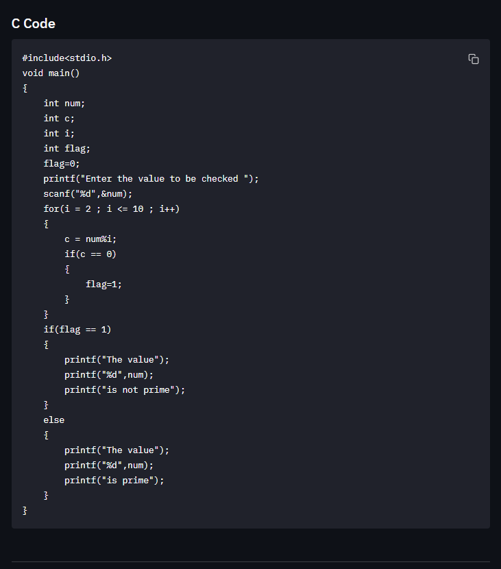

# NeuralCodeGenerator

This is a small project that uses a opinionated pseudocode and auugments it with Natural Language Processing to allow users to use more keywords that are similar to the ones already in use.

```py
start 
assign ( num int )
assign ( c int )
allot ( i int )
define ( flag int )
assign flag to 0
display "Enter the value to be checked "
read (num int)
for i from 2 to 10
repetition 
c = num%i
if c==0
then
assign flag to 1
endif
endfor
if flag==1
then
print "The value"
print (num int)
print "is not prime"
else
print "The value"
print (num int)
print "is prime"
endif
end
```


It produces the C code as the following


```c
#include<stdio.h>
void main()
{
    #include<stdio.h>
void main()
{
    int num;
    int c;
    int i;
    int flag;
    flag=0;
    printf("Enter the value to be checked ");
    scanf("%d",&num);
    for(i = 2 ; i <= 10 ; i++)
    {
        c = num%i;
        if(c == 0)
        {
            flag=1;
        }
    }
    if(flag == 1)
    {
        printf("The value");
        printf("%d",num);
        printf("is not prime");
    }
    else
    {
        printf("The value");
        printf("%d",num);
        printf("is prime");
    }
}
```

# Installation

Simply execute the following after cloning the git repository to a suitable directory.

```sh
pip install -r requirements.txt
```

Then you should download the `en_web_core_lg` model for spacy using
```sh
python -m spacy download en_core_web_lg
```
This model uses ~800MB of memory, so please make sure that you have enough beforehand.

Now you can finally use opyrator environment to test out the converter.

# Running the project
After all the install steps, you should launch the UI using
```sh
opyrator launch-ui converterfunc:C_Code_Generator
```
Doing so would prompt you to launch a beautiful UI allowing you to interactively test the converter.


You can provide it some input in the message box.


Then you execute it, be wary that the execution times will depend on the length of the code and the performace of the host computer as it heavily relies on finding vector similarity.


Please note that the project uses a compiled binary from the [Astyle Project](http://astyle.sourceforge.net/), and hence it's included in the source.